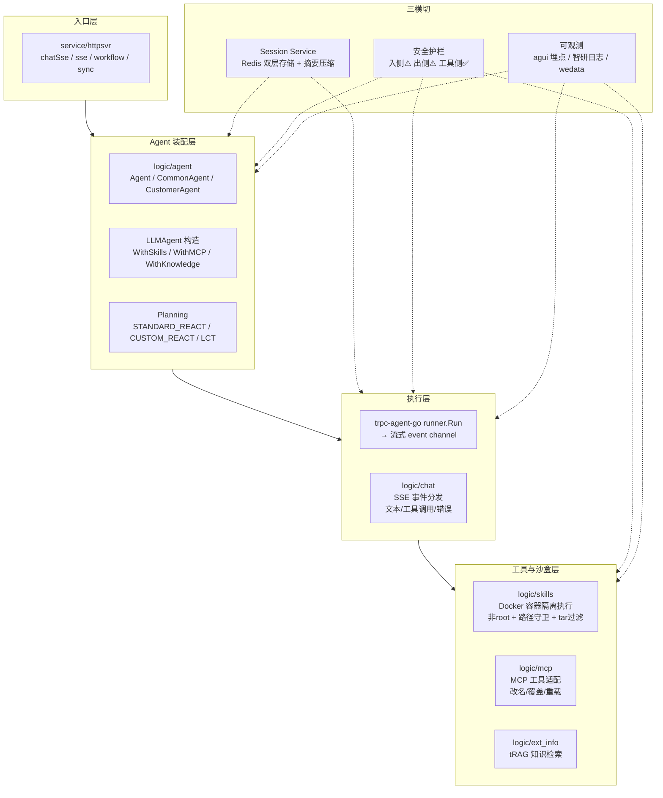

# Agent 编排架构深度分析

## 一、整体架构概览

engine 是一个基于 **trpc-agent-go** 框架构建的 AI Agent 引擎服务。它的核心设计哲学可以概括为：**"下盘很重、上盘偏轻"**——沙箱安全、错误分类、子 Agent 编排做得非常扎实，但上下文工程、记忆分层、验证循环等相对薄弱。

整体架构可画为四层 + 三横切：



---

## 二、已实现的 Agent 概念深度分析

### 2.1 Agent 类型体系（5 种实现）

| Agent 类型                | 文件                            | 定位                                                         | 状态       |
| ------------------------- | ------------------------------- | ------------------------------------------------------------ | ---------- |
| **`Agent`**               | `logic/agent/agent.go`          | 主 Agent，封装 LLMAgent + Runner + 工具/知识/会话            | ✅ 核心链路 |
| **`CommonAgent`**         | `logic/agent/common_agent.go`   | 共享 Agent，承载 MainAgent + SubAgents + MCPInitErrors       | ✅          |
| **`CustomerAgent`**       | `logic/agent/customer_agent.go` | 支持子 Agent **handoff 转接**，基于 Redis 持久化活跃子 Agent | ✅          |
| **`CustomerTuiFeiAgent`** | `custom_tuifei_agent/`          | 退费业务专用变体，Planner-Solver 双 Agent 协作               | ✅ 业务定制 |
| **`Chain`**               | `logic/agent/chain/chain.go`    | 链式 Agent 占位（**todo，未实现**）                          | ❌ 骨架     |
| **`WorkFlowAgent`**       | `logic/agent/workflow/agent.go` | 工作流执行 Agent，DAG 图调度                                 | ✅          |

关键代码路径（**CommonAgent 装配**）：

```
chatSse → SseChatWithExtra → agent.NewAgent
  → GetCommOriginAgentWithExtra
    → getCommOriginAgentInternal
      → 拉配置(dao/ext_info) → 构造模型 → 注册 Callbacks
      → WithSkills / WithMCPTools / WithKnowledge
      → WithPlanner(STANDARD_REACT | CUSTOM_REACT | LCT)
      → llmagent.New → CommonAgent
  → agent.Run1
    → runner.Run → 流式 event → Reply/ReActReply → SSE 推送
```

### 2.2 规划范式（3 种 Planner）

这是 engine 最核心的设计决策之一，体现在 `common_agent.go` 的 planner 选择逻辑中：

| Planner 模式       | PlannerType                  | 实现                                          | 特点                                                         |
| ------------------ | ---------------------------- | --------------------------------------------- | ------------------------------------------------------------ |
| **STANDARD_REACT** | `PlannerMode_STANDARD_REACT` | `treact.New()` (框架内置)                     | 标准 ReAct: Thinking → Action → Observation                  |
| **CUSTOM_REACT**   | `PlannerMode_CUSTOM_REACT`   | `react.New(plannerPrompt)` / `react.NewLct()` | 自定义标签: `/*PLANNING*/` `/*ACTION*/` `FINAL ANSWER:`      |
| **退费自定义**     | —                            | `CustomPlanner` (custom_tuifei_agent)         | Planner-Solver 双 Agent 串行: Planner 意图识别 → Solver 执行响应 |

**CUSTOM_REACT 的标签体系**（对应你提到的 2×2 矩阵选型）：

```
/*PLANNING*/    → 规划阶段，拆解任务
/*REPLANNING*/  → 重规划，遇到异常时调整
/*REASONING*/   → 推理过程（标记为 thought，不展示给用户）
/*ACTION*/      → 工具调用意图声明
FINAL ANSWER:   → 最终答案标记
```

**退费场景的 Planner-Solver 双 Agent 模式**是最接近你提到的"军政分离"思想的实践：

- **Planner Agent**：负责意图识别和工具路由（"要不要查数据库"）
- **Solver Agent**：负责接收 Planner 结果，生成最终响应（不关心"怎么写 SQL"）
- 两者通过 `appendSessionEvent` 传递抽象的中间结果，**不是原始 JSON**

### 2.3 子 Agent 编排（3 种拓扑）

这是 engine 在子 Agent 协作上做得最扎实的部分：

```go
// 位于 agent.go 的 NewAgent 函数
switch agentConf.AgentType {
case SWARM_AGENT:     // 团体协作 (Swarm)
case COORDINATOR_AGENT: // 协调者模式 (Coordinator)
case DEFAULT_AGENT:    // 默认单 Agent
}
```

**Swarm 模式**（团体协作）：
- 使用 `team.NewSwarm` 原生支持 handoff
- `CrossRequestTransfer(true)` + `SwarmIndependentAgents()` 实现**跨请求子 Agent 缓存**
- 每轮从上次活跃的子 Agent 继续，而非重新从主 Agent 开始
- HistoryScope: 隔离模式（子 Agent 互不可见对方历史）

**Coordinator 模式**（协调者）：
- 使用 `team.New` 实现层级式调度
- `HistoryScopeParentBranch`：子 Agent 仅看到父 Agent 的历史
- `StreamInner=true`：子 Agent 流式事件透传

**CustomerAgent 的 Handoff 机制**（自研）：
- 通过 `TransferSignalPrefix = "Transferring control to agent: "` 识别转接信号
- 活跃子 Agent 名称持久化到 Redis（`current_agent_name_{userid}`）
- 跨轮次继续执行同一子 Agent，无需每次重新 handoff

### 2.4 工作流引擎（16 种节点类型）

工作流实现了一套完整的 DAG 执行引擎：

```go
// workflow/public/nodes.go
NodeTypeStart     // 开始节点
NodeTypeEnd       // 结束节点
NodeTypeCondition // 条件分支
NodeTypeLLM       // LLM 节点
NodeTypeAgent     // Agent 节点（嵌套 Agent）
NodeTypeInterface // HTTP 接口调用
NodeTypeScript    // 话术节点
NodeTypeQueue     // 人工排队节点
NodeTypeCollectLLM   // 要素采集 LLM
NodeTypeRiskWord     // 风险词检测
NodeTypeCode         // Python 脚本执行
NodeTypeDatabase     // 数据库操作(mysql/es/redis/kafka)
NodeTypeImageRecognition // 图片识别
NodeTypeIteration    // 迭代容器（对数组逐项执行子图）
NodeTypeBreak        // 迭代容器内跳出
NodeTypeRetryWrapper // 重试包装节点
```

**关键设计特点**：

1. **静态入度并行**：通过 `computeStaticInDegree` 计算每个节点的上游数，上游全部完成后才执行
2. **断点续跑**：工作流状态（Variables/NodeOutputs/NodeStates）持久化到 Redis，支持中断恢复
3. **迭代节点**：容器式设计，内嵌子图，通过 `SubGraphExecutor` 接口解耦循环依赖；支持 Worker Pool 并发 + 断点续跑（Redis Bitmap）
4. **重试包装节点**：内置重试 + 快照隔离 + 输出校验 + 降级兜底
5. **单节点调试**：`ExecuteSingleNode` 模式支持只执行指定节点

### 2.5 工具系统

工具系统建立在 trpc-agent-go 的 Tool 抽象之上，engine 做了三层封装：

| 层           | 实现                    | 功能                                                         |
| ------------ | ----------------------- | ------------------------------------------------------------ |
| **MCP 适配** | `logic/mcp/mcp.go`      | 将 MCP Server 的 tools 转化为 trpc-agent-go ToolSet          |
| **工具改名** | `renamed_toolset.go`    | 注入 LLM 时改名（原始名→业务友好名），保持协议不变           |
| **参数覆盖** | `overridden_toolset.go` | alias 键还原 + hide_from_llm 字段 default_value 注入         |
| **流式兼容** | 三种包装                | `renamedTool` / `renamedCallableTool` / `renamedStreamableTool` 按原始能力分类包装 |

关键修复点：MCP 工具被包装后 `StreamableCall` 的 interface assertion 被破坏，通过三种分层包装类型保持原始行为一致。

### 2.6 安全沙盒（Skill 执行）

Skill 容器化执行是 engine 安全模型的基石：

| 安全维度         | 实现                                             | 状态   |
| ---------------- | ------------------------------------------------ | ------ |
| **非 root 执行** | `USER skill(uid=1000)`，不装 sudo                | ✅      |
| **路径穿越防御** | 所有读写强制 `filepath.Clean` + `HasPrefix` 守卫 | ✅      |
| **tar 流过滤**   | 拒绝 `../`、反斜杠、symlink                      | ✅      |
| **目录隔离**     | 容器内 `/workspace/<sessionID>/` 按会话隔离      | ✅      |
| **Agent 隔离**   | 不同 agentID 独立容器                            | ✅      |
| **网络隔离**     | 预装 iptables+capsh，**尚未激活**                | ⚠️ 预留 |
| **进程重启复用** | `AutoRemove=false`，ContainerInspect 复用        | ✅      |

### 2.7 错误处理 & 自愈

`ClassifyError` 实现了一个表驱动的错误分类器：

```
优先级 1: 认证错误 (auth/token/permission)
优先级 2: 验证错误 (invalid/malformed)
优先级 3: 工具错误 (tool/mcp/function_call)
优先级 4: 数据错误 (database/sql/redis)
优先级 5: 超时错误 (timeout/deadline)
优先级 6: 网络错误 (connection/dial/refused)
```

设计思想：**业务语义优先于基础设施语义**。例如 `"tool call timeout"` 会归类为"工具错误"（priority 3）而非"超时错误"（priority 5）。

容器自愈：OOM 或容器被杀 → `maybeMarkExecutorDead` → 下个请求 `inspectOrCreate` 重建。

### 2.8 会话/上下文管理

| 能力               | 实现                                                         | 评级 |
| ------------------ | ------------------------------------------------------------ | ---- |
| **双层会话存储**   | 自研 RedisStore(用户态KV) + trpc-agent-go SessionService(事件流) | ✅    |
| **历史轮次裁剪**   | `ContextRounds` 按对话块裁剪（默认 10 轮）                   | ✅    |
| **会话摘要**       | token/event/context 三阈值 + 同步/异步 worker + 按 agent 分发 | ✅✅   |
| **工具结果限长**   | `ToolResultSizeVerify` 硬截断（超限→替换提示文案）           | ⚠️    |
| **截断残片净化**   | `SanitizeTruncatedAssistantMessage` 追加 SYSTEM_NOTICE       | ✅    |
| **隐私 URL 掩码**  | BeforeModel 替换→AfterModel 还原（含 ToolCalls.Arguments）   | ✅    |
| **消息过滤**       | `FilterMessages` 按 ToolName 滚动保留最近 N 条               | ✅    |
| **Token 预算**     | ❌ 无统一计量                                                 | ❌    |
| **工具结果懒加载** | ❌ 超限直接丢失                                               | ❌    |
| **长期记忆**       | ❌ 无结构化事实层                                             | ❌    |

---

## 三、与你提出的 12 项决策对照

| #    | 你提出的决策              | engine 现状                                                  | 差距 |
| ---- | ------------------------- | ------------------------------------------------------------ | ---- |
| 1    | 规划范式分层混合          | 实现了 ReAct + Custom React + Planner-Solver 三种，但未显式分层 | ⚠️    |
| 2    | Planner/Executor 军政分离 | 退费场景做到了 Planner-Solver 分离，但通用链路仍是同一上下文 | ⚠️    |
| 3    | 工具粒度按业务动词        | MCP 工具以业务语义暴露，`renamed_toolset` 支持改名；但无粒度审计机制 | ⚠️    |
| 4    | 记忆三层架构              | 短期✅ 工作✅（workspace文件） 长期❌（仅文件层，无结构化）     | ❌    |
| 5    | 执行沙盒与安全边界        | 容器隔离✅ 路径守卫✅ 非root✅ 权限分级⚠️ HITL(人工节点)✅        | ⚠️    |
| 6    | 模型异构部署              | 每 Agent 独立配模型，但模型和 prompt 松耦合，无 model_profile | ⚠️    |
| 7    | 可观测/可审计/可回溯      | agui 埋点✅ 智研日志✅ 但无结构化 prompt 落盘、无 checkpoint   | ⚠️    |
| 8    | 失败恢复与重规划          | RetryWrapper 节点✅ 容器自愈✅ 但 ReAct 层面无 re-plan 机制    | ⚠️    |
| 9    | 成本/延迟/能力三角        | 摘要压缩✅ 轮次裁剪✅ 但无 Token 预算守门                      | ❌    |
| 10   | 自主性分级/HITL           | 人工节点(queue)✅ 但无"执行前确认"细粒度机制                  | ⚠️    |
| 11   | 部署形态                  | 云端部署，无本地优先方案                                     | 无关 |
| 12   | 扩展机制/技能生态         | Skill zip 解压→Docker 执行，但无 ClawHub 式的共享生态        | ⚠️    |

---

## 四、代码实现特点总结

### 亮点

1. **扎实的框架选型**：基于 trpc-agent-go，复用了 runner、session、planner、llmagent 等基础设施，不做重复造轮子
2. **回调链体系完整**：BeforeModel / AfterModel / BeforeTool / AfterTool 四层钩子覆盖全生命周期
3. **安全第一的 Skill 沙盒**：Docker 容器 + 非 root + 路径守卫 + tar 过滤，三层防御
4. **表驱动错误分类**：`ClassifyError` 优先级匹配，业务语义优先，易扩展
5. **工作流 DAG 引擎设计精细**：静态入度并行、断点续跑、迭代容器、重试包装、单节点调试
6. **子 Agent 编排灵活**：Swarm 模式原生 handoff + Coordinator 模式层级调度 + 自研跨轮次缓存
7. **会话摘要**：三阈值 + 同步/异步 + 分发器，在业界属于第一梯队
8. **文档驱动开发**：`harness-optimization.md` 和 `CONTEXT_MANAGEMENT_PLAN.md` 两份高质量设计文档

### 痛点

1. **上下文管理"下盘重上盘轻"**：工具结果硬截断丢信息，无 Token 预算，无懒加载
2. **无 Checkpoint/时间旅行**：出问题只能靠日志排查，无法回放调试
3. **无验证循环 (Critic)**：LLM 输出没有结构化二次校验，全靠人工兜底
4. **护栏粗糙**：出侧直接整段替换为 DefaultReply，而非精确擦除
5. **记忆不跨会话**：用户偏好、项目约定无法沉淀
6. **工具缺少元数据**：无 ReadOnly/Idempotent/RiskLevel 标签，无法做智能分级
7. **提示词构建是字符串拼接**：无分层 system/user/tool result 结构化装配

---

## 五、改进空间与优先级建议

结合内部文档 `harness-optimization.md` 的评估，建议分三阶段：

### 第一阶段（P0，≤2 周）：上下文管理 + 护栏修复

1. **工具结果"摘要式截断"**：保留头尾，让 LLM 仍能基于线索继续（而非整条丢弃）
2. **Token 预算守门**：BeforeModel 第一关估算 token，超阈值则压缩老轮次
3. **护栏改"擦除而非抛弃"**：发现占位符泄漏 → 擦除该片段，剩余内容保留
4. **工具结果懒加载**（`ToolResultRegistry`）：大结果写 Redis，给 LLM 返回 schema+sample+ctx_id，让其按需 `read_tool_result`

### 第二阶段（P1，2 周）：质量 + 记忆

5. **Critic 验证循环**：对写操作/强约束轮次跑二次校验，最多重试 1 次
6. **长期记忆 L2**：异步抽取用户偏好/常用实体，下次注入 system prompt
7. **Tool metadata**：ReadOnly/Idempotent/RiskLevel 标签，支持自动重试判断和 Critic 触发

### 第三阶段（P2，持续）：可观测 + 协同演化

8. **Checkpoint + 时间旅行**：ReAct 每步快照落 Redis/ClickHouse，支持回放分叉
9. **模型-Harness 协同演化**：model_profile 绑定 prompt + tool schema 风格
10. **Fork/Worktree 子 Agent 拓扑**：并行探索 + 投票
11. **Harness 厚度可观测**：季度监控 prompt token 占比/critic 触发率/ReAct 平均轮数，主动删脚手架

---

## 六、一句话总结

engine 的 Agent 编排设计走的是 **"扎实的内环 + 可演进的外环"** 路线：安全沙箱、错误分类、子 Agent 编排、工作流引擎这些"内环"做得非常扎实；上下文工程、记忆分层、验证循环这些"外环"已经完成了架构规划（`harness-optimization.md` 和 `CONTEXT_MANAGEMENT_PLAN.md`），等待工程落地。与你提到的 OpenClaw 设计哲学高度一致——**"让 LLM 决定要不要查数据库，而不是让 LLM 决定 SQL 怎么写"** 这一原则，在退费场景的 Planner-Solver 双 Agent 分离中已经实践，只是尚未泛化到全链路。
